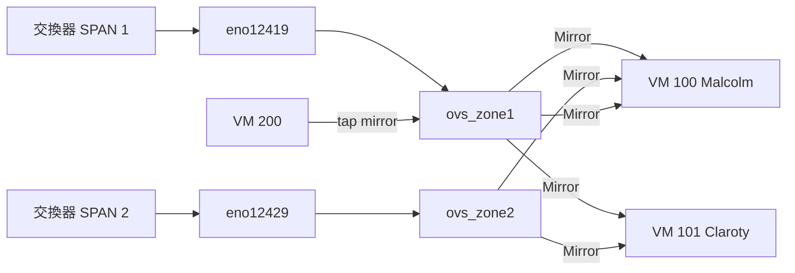

# proxmox-ovs-mirror

Proxmox VE + Open vSwitch 流量鏡像自動配置工具。透過設定檔定義 mirror 規則，搭配 VM Hookscript 在 VM 啟動/關閉時自動管理 OVS Mirror。

## 功能特色

- **設定檔驅動**：所有 mirror 規則定義在 `/etc/ovs-mirror/mirrors.conf`，不需修改腳本
- **動態 N Zone**：支援任意數量的 OVS bridge
- **1-to-Many**：一個來源 port 可鏡像到多台 VM
- **VM-to-VM**：支援鏡像另一台 VM 的 tap 介面
- **自動生命週期管理**：Hookscript 自動處理 VM 開關機時的 mirror 配置與清理
- **VM 保護**：當作為鏡像來源或目標的 VM 關機時，自動清除引用其 tap 的 mirror，避免 OVS 錯誤
- **失敗回滾**：部分 mirror 建立失敗時自動回滾已建立的 mirror
- **互動式安裝**：`install.sh` 引導設定並自動安裝

## 架構



```
VM 啟動 (post-start) → Hookscript 觸發 → 配置 Mirror
VM 關閉 (pre-stop)  → Hookscript 觸發 → 清理 Mirror（含 source 保護）
VM 關閉 (post-stop) → Hookscript 觸發 → 驗證清理完成
```

## 快速開始

```bash
# 建立 hookscript 儲存路徑
mkdir /var/lib/vz/snippets/

git clone https://github.com/<your-repo>/proxmox-ovs-mirror.git
cd proxmox-ovs-mirror
sudo ./install.sh
```

安裝程式會引導進行：

1. 檢查環境（root、OVS、Proxmox）
2. 探索 OVS bridge 拓撲
3. 互動式建立 mirror 規則
4. 安裝腳本與設定檔
5. 綁定 hookscript 到相關 VM
6. 選擇性立即啟用 mirror

### 非互動式安裝

```bash
# 使用預先準備的設定檔
sudo ./install.sh --non-interactive --config mirrors.conf --activate
```

### 解除安裝

```bash
sudo ./install.sh --uninstall
```

## 檔案

| 檔案 | 安裝路徑 | 說明 |
|------|----------|------|
| `configure-ovs-mirrors.sh` | `/usr/local/bin/` | Mirror 管理主腳本 |
| `ovs-mirror-hook.sh` | `/var/lib/vz/snippets/` | Proxmox VM Hookscript |
| `install.sh` | （從 repo 執行） | 互動式安裝程式 |
| `ovs-mirror` | `/etc/logrotate.d/` | 日誌輪替設定 |

安裝後產生的設定檔：

| 檔案 | 路徑 |
|------|------|
| Mirror 規則 | `/etc/ovs-mirror/mirrors.conf` |
| 全域設定 | `/etc/ovs-mirror/ovs-mirror.conf` |

## 設定檔格式

### mirrors.conf

每行一條 mirror 規則，欄位以空白分隔：

```
BRIDGE  SOURCE_PORT  DEST_VMID  DEST_NIC_INDEX  [OPTIONS...]
```

| 欄位 | 說明 | 範例 |
|------|------|------|
| `BRIDGE` | OVS bridge 名稱 | `ovs_zone1` |
| `SOURCE_PORT` | 來源 port（實體 port 或 VM tap） | `eno12419` 或 `vm200:0` |
| `DEST_VMID` | 目的 VM ID | `100` |
| `DEST_NIC_INDEX` | 目的 VM 的 NIC 索引（自動衍生為 `tap<VMID>i<INDEX>`） | `1` |

**SOURCE_PORT 格式：**

- 實體 port：直接寫名稱，如 `eno12419`
- VM tap：使用 `vm<VMID>:<NIC_INDEX>`，如 `vm200:0` 代表 `tap200i0`

**可選 OPTIONS（key=value）：**

| 選項 | 值 | 說明 | 預設值 |
|------|----|------|--------|
| `promisc` | `yes` / `no` | 來源 port 的 promiscuous mode | 實體 port: `yes`，VM tap: `no` |
| `select` | `both` / `src` / `dst` | mirror 方向 | `both` |

**完整範例：**

```conf
# 實體 SPAN port 鏡像到多台 VM
ovs_zone1  eno12419  100  1
ovs_zone1  eno12419  101  1

# 另一個 Zone
ovs_zone2  eno12429  100  2
ovs_zone2  eno12429  101  2

# VM-to-VM：鏡像 VM 200 的 NIC 0 到 VM 100 的 NIC 3
ovs_zone1  vm200:0  100  3  promisc=no

# 僅鏡像單方向流量
ovs_zone1  eno12419  102  1  select=src
```

### ovs-mirror.conf

全域設定（可選，有預設值）：

```conf
MAX_WAIT=120         # 等待 tap 介面出現的最大秒數
WAIT_INTERVAL=5      # 輪詢間隔秒數
LOG_DIR=/var/log/openvswitch
```

## 使用方式

```bash
# 查看狀態與健康檢查
configure-ovs-mirrors.sh --status

# 驗證設定檔語法
configure-ovs-mirrors.sh --validate

# 配置所有 mirror
configure-ovs-mirrors.sh --all

# 配置指定 VM 的 mirror
configure-ovs-mirrors.sh --vm 100

# 清除指定 VM 的所有 mirror（含作為來源和目的地）
configure-ovs-mirrors.sh --cleanup 100

# 僅清除 VM 作為目的地的 mirror
configure-ovs-mirrors.sh --cleanup-dest 100

# 僅清除 VM 作為來源的 mirror
configure-ovs-mirrors.sh --cleanup-source 200

# 使用替代設定檔
configure-ovs-mirrors.sh --config /path/to/custom.conf --status
```

## Hookscript 運作方式

Hookscript 會自動從 `/etc/ovs-mirror/mirrors.conf` 判斷每台 VM 的角色（destination、source、或兩者），並在 VM 生命週期事件中做出對應動作：

| 事件 | Destination VM | Source VM |
|------|----------------|-----------|
| `post-start` | 建立指向此 VM 的 mirror | 執行 `--all` 重建引用其 tap 的 mirror |
| `pre-stop` | 清除指向此 VM 的 mirror | 清除引用其 tap 的 mirror（避免 OVS 錯誤） |
| `post-stop` | 驗證清理完成 | 驗證清理完成 |

> **Destination VM 保護**：當接收鏡像流量的 VM 關機時（如 VM 100 的 `tap100i1` 作為 mirror 的 `output-port`），hookscript 會在 `pre-stop` 階段清除指向此 VM 的 mirror，避免 OVS 因 output-port 消失而產生 dangling reference 錯誤。
>
> **Source VM 保護**：當作為鏡像來源的 VM 關機時（如 VM 200 的 `tap200i0` 被其他 mirror 引用為 source），hookscript 同樣會在 `pre-stop` 階段先清除這些 mirror，避免 OVS 因找不到來源介面而報錯。

## 驗證

### 檢查 OVS 狀態

```bash
# 查看 OVS bridge 和 port 整體狀態
ovs-vsctl show

# 列出所有 Mirror 物件的詳細資訊
ovs-vsctl list Mirror
```

### 使用腳本內建狀態檢查

```bash
# 顯示 OVS 狀態 + 設定檔規則 + 健康檢查
configure-ovs-mirrors.sh --status
```

輸出範例：

```
=== OVS Bridges ===
(ovs-vsctl show output)

=== Active Mirrors ===
(ovs-vsctl list Mirror output)

=== Config File Rules ===
  #    Bridge          Source             Dest VM    Dest TAP     Mirror Name
  ---  ---------------  ------------------  ----------  ------------  ---
  1    ovs_zone1        eno12419            VM100       tap100i1      mirror_ovs_zone1_eno12419_to_vm100i1
  2    ovs_zone1        eno12419            VM101       tap101i1      mirror_ovs_zone1_eno12419_to_vm101i1
  Total: 2 rules

=== Mirror Health Check ===
  [OK]   mirror_ovs_zone1_eno12419_to_vm100i1
  [OK]   mirror_ovs_zone1_eno12419_to_vm101i1
  Result: 2 active, 0 missing
```

### 驗證設定檔

```bash
configure-ovs-mirrors.sh --validate
```

### 在 VM 內確認收到流量

```bash
# 在監控 VM 內執行
tcpdump -i ens19 -nn -c 10
```

### 查看日誌

```bash
# Mirror 管理腳本日誌
tail -f /var/log/openvswitch/ovs-mirrors.log

# Hookscript 日誌
tail -f /var/log/openvswitch/ovs-mirror-hook.log
```

## 疑難排解

### Mirror 未建立

1. 確認 bridge 存在：`ovs-vsctl list-br`
2. 確認 source port 在 bridge 上：`ovs-vsctl list-ports <bridge>`
3. 確認 VM 已啟動且 tap 介面存在：`ovs-vsctl list-ports <bridge> | grep tap`
4. 驗證設定檔：`configure-ovs-mirrors.sh --validate`
5. 查看日誌：`tail -50 /var/log/openvswitch/ovs-mirrors.log`

### OVS 報告介面不存在錯誤

- 通常是 source VM 關機但 mirror 未被清理
- 確認 source VM 已綁定 hookscript：`qm config <vmid> | grep hookscript`
- 手動清理：`configure-ovs-mirrors.sh --cleanup <vmid>`

### Hookscript 未觸發

- 確認 hookscript 已綁定：`qm config <vmid> | grep hookscript`
- 綁定 hookscript：`qm set <vmid> --hookscript local:snippets/ovs-mirror-hook.sh`
- 確認設定檔存在：`cat /etc/ovs-mirror/mirrors.conf`
- 確認 VM ID 出現在設定檔中

### 權限問題

- 腳本需以 root 執行
- 確認執行權限：`chmod +x /usr/local/bin/configure-ovs-mirrors.sh /var/lib/vz/snippets/ovs-mirror-hook.sh`

## License

MIT
