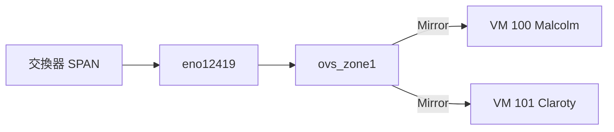

# proxmox-ovs-mirror

Proxmox VE + Open vSwitch 流量鏡像自動配置工具。透過 VM Hookscript 在 VM 啟動/關閉時自動管理 OVS Mirror 規則。

## 架構



```
VM 啟動 (post-start) → 配置 Mirror
VM 關閉 (pre-stop)  → 清理 Mirror
```

## 檔案

| 檔案 | 安裝路徑 |
|------|----------|
| `ovs-mirror-hook.sh` | `/var/lib/vz/snippets/` |
| `configure-ovs-mirrors.sh` | `/usr/local/bin/` |
| `ovs-mirrors.service` | `/etc/systemd/system/` |
| `ovs-mirrors.logrotate` | `/etc/logrotate.d/ovs-mirrors` |

## 安裝

```bash
# 日誌目錄
mkdir -p /var/log/openvswitch /var/lib/vz/snippets/

# 安裝腳本
cp ovs-mirror-hook.sh /var/lib/vz/snippets/
cp configure-ovs-mirrors.sh /usr/local/bin/
chmod +x /var/lib/vz/snippets/ovs-mirror-hook.sh /usr/local/bin/configure-ovs-mirrors.sh

# 綁定 hookscript
qm set 100 --hookscript local:snippets/ovs-mirror-hook.sh
qm set 101 --hookscript local:snippets/ovs-mirror-hook.sh
```

## 配置

編輯 `configure-ovs-mirrors.sh`：

```bash
ZONE1_BRIDGE="ovs_zone1"
ZONE1_PORT="eno12419"

declare -A VM_TAPS_Z1=(
    [100]="tap100i1"
    [101]="tap101i1"
)
```

## 使用

```bash
# 查看狀態
configure-ovs-mirrors.sh --status

# 手動配置
configure-ovs-mirrors.sh --all
configure-ovs-mirrors.sh --vm 100
configure-ovs-mirrors.sh --cleanup 100
```

## 驗證

```bash
# VM 內確認收到流量
tcpdump -i ens19 -nn -c 10

# 查看日誌
tail -f /var/log/openvswitch/*.log
```
